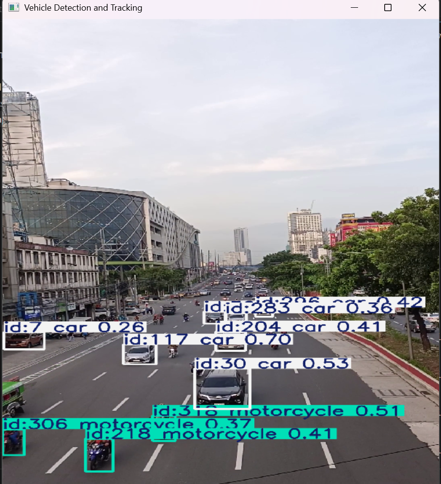
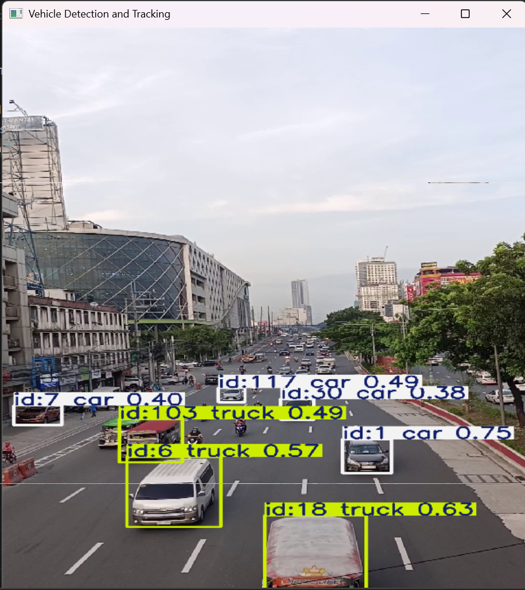

### PROJECT TITLE
Real-Time Vehicle Detection and Tracking using YOLOv8 and OpenCV

## Short Description
This project performs real-time vehicle detection and tracking using a pre-trained YOLOv8 model and OpenCV. The system processes video frames, detects vehicles such as cars, buses, trucks, and motorcycles, draws bounding boxes around them, and assigns tracking IDs using ByteTrack.

## Screenshots

